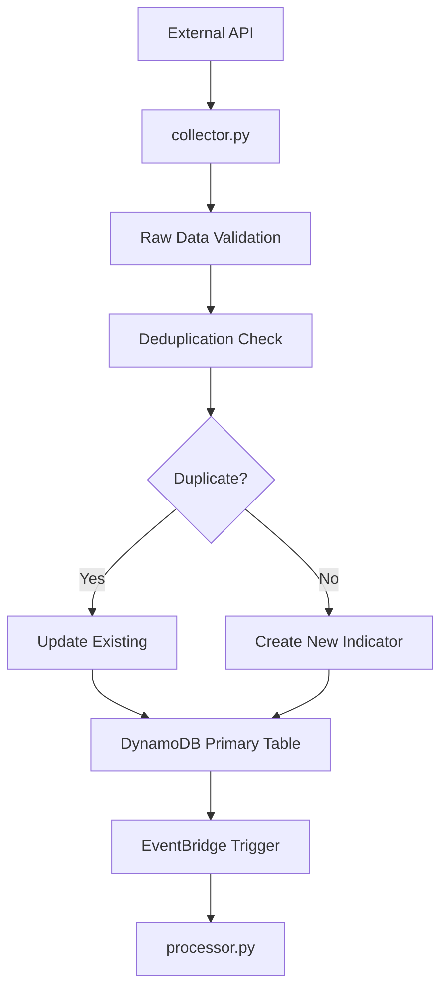
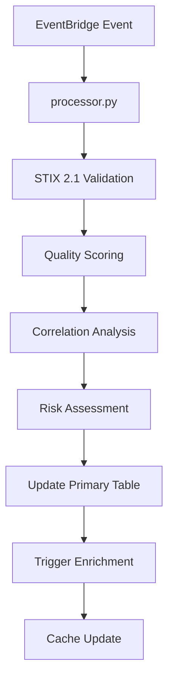
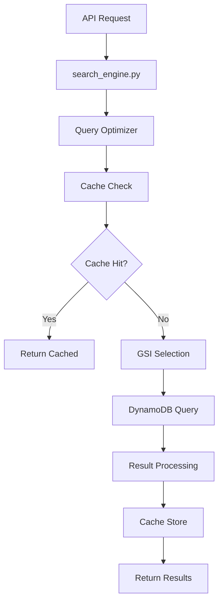

# Data Models and Schema Documentation

## Overview

This document provides comprehensive documentation of the data models, DynamoDB schema design, and data flow patterns for the serverless threat intelligence platform. Understanding these models is critical for maintaining data consistency and performance as the system scales.

## DynamoDB Table Architecture

### 1. Primary Table: threat-intelligence

**Purpose**: Central repository for all threat intelligence indicators with STIX 2.1 compliance.

**Schema Design**:
```json
{
  "TableName": "threat-intel-dev",
  "KeySchema": [
    {
      "AttributeName": "indicator_id",
      "KeyType": "HASH"
    },
    {
      "AttributeName": "timestamp",
      "KeyType": "RANGE"
    }
  ],
  "AttributeDefinitions": [
    {"AttributeName": "indicator_id", "AttributeType": "S"},
    {"AttributeName": "timestamp", "AttributeType": "S"},
    {"AttributeName": "source", "AttributeType": "S"},
    {"AttributeName": "pattern_hash", "AttributeType": "S"},
    {"AttributeName": "risk_score", "AttributeType": "N"},
    {"AttributeName": "threat_type", "AttributeType": "S"},
    {"AttributeName": "geographic_region", "AttributeType": "S"},
    {"AttributeName": "ioc_type", "AttributeType": "S"},
    {"AttributeName": "ioc_value", "AttributeType": "S"},
    {"AttributeName": "last_modified", "AttributeType": "S"},
    {"AttributeName": "confidence", "AttributeType": "N"}
  ]
}
```

**Item Structure**:
```json
{
  "indicator_id": "ind-uuid4-generated",
  "timestamp": "2024-01-01T00:00:00.000Z",
  "ioc_value": "malicious.domain.com",
  "ioc_type": "domain",
  "threat_type": "malware",
  "source": "otx",
  "confidence": 85,
  "risk_score": 75,
  "geographic_region": "US",
  "pattern_hash": "sha256-hash-of-pattern",
  "stix_object": {
    "type": "indicator",
    "spec_version": "2.1",
    "id": "indicator--uuid4",
    "created": "2024-01-01T00:00:00.000Z",
    "modified": "2024-01-01T00:00:00.000Z",
    "pattern": "[domain-name:value = 'malicious.domain.com']",
    "labels": ["malicious-activity"],
    "confidence": 85
  },
  "enrichment_data": {
    "geolocation": {
      "country": "RU",
      "region": "Moscow",
      "latitude": 55.7558,
      "longitude": 37.6176,
      "confidence": 95
    },
    "reputation": {
      "risk_score": 85,
      "reputation_score": 15,
      "threat_level": "high",
      "sources_count": 8
    },
    "dns_analysis": {
      "a_records": ["192.168.1.100"],
      "mx_records": [],
      "ns_records": ["ns1.malicious.com"],
      "txt_records": []
    }
  },
  "correlation_data": {
    "related_indicators": ["ind-uuid2", "ind-uuid3"],
    "campaign_id": "camp-uuid",
    "attribution": {
      "threat_actor": "APT-29",
      "confidence": 70
    }
  },
  "processing_metadata": {
    "created_at": "2024-01-01T00:00:00.000Z",
    "last_modified": "2024-01-01T12:00:00.000Z",
    "processing_version": "8.2",
    "quality_score": 92,
    "validation_status": "validated"
  },
  "expiry_ttl": 1735689600
}
```

### 2. Global Secondary Indexes (GSIs)

#### GSI 1: time-index
```json
{
  "IndexName": "time-index",
  "KeySchema": [
    {"AttributeName": "timestamp", "KeyType": "HASH"},
    {"AttributeName": "confidence", "KeyType": "RANGE"}
  ],
  "Projection": {
    "ProjectionType": "ALL"
  }
}
```
**Usage**: Time-based queries, temporal analysis, trending.

#### GSI 2: source-index
```json
{
  "IndexName": "source-index",
  "KeySchema": [
    {"AttributeName": "source", "KeyType": "HASH"},
    {"AttributeName": "timestamp", "KeyType": "RANGE"}
  ],
  "Projection": {
    "ProjectionType": "INCLUDE",
    "NonKeyAttributes": ["ioc_value", "ioc_type", "confidence", "risk_score"]
  }
}
```
**Usage**: Source-specific queries, data quality analysis.

#### GSI 3: pattern-hash-index
```json
{
  "IndexName": "pattern-hash-index",
  "KeySchema": [
    {"AttributeName": "pattern_hash", "KeyType": "HASH"}
  ],
  "Projection": {
    "ProjectionType": "KEYS_ONLY"
  }
}
```
**Usage**: Deduplication checks, pattern matching.

#### GSI 4: risk-analytics-index
```json
{
  "IndexName": "risk-analytics-index",
  "KeySchema": [
    {"AttributeName": "risk_score", "KeyType": "HASH"},
    {"AttributeName": "threat_type", "KeyType": "RANGE"}
  ],
  "Projection": {
    "ProjectionType": "INCLUDE",
    "NonKeyAttributes": ["ioc_value", "geographic_region", "confidence"]
  }
}
```
**Usage**: Risk-based filtering, analytics queries.

#### GSI 5: geographic-index
```json
{
  "IndexName": "geographic-index",
  "KeySchema": [
    {"AttributeName": "geographic_region", "KeyType": "HASH"},
    {"AttributeName": "timestamp", "KeyType": "RANGE"}
  ],
  "Projection": {
    "ProjectionType": "INCLUDE",
    "NonKeyAttributes": ["ioc_value", "threat_type", "risk_score"]
  }
}
```
**Usage**: Geographic analysis, regional threat mapping.

#### GSI 6: ioc-pattern-index
```json
{
  "IndexName": "ioc-pattern-index",
  "KeySchema": [
    {"AttributeName": "ioc_type", "KeyType": "HASH"},
    {"AttributeName": "ioc_value", "KeyType": "RANGE"}
  ],
  "Projection": {
    "ProjectionType": "INCLUDE",
    "NonKeyAttributes": ["confidence", "risk_score", "source"]
  }
}
```
**Usage**: IOC-specific searches, indicator type analysis.

#### GSI 7: temporal-correlation-index
```json
{
  "IndexName": "temporal-correlation-index",
  "KeySchema": [
    {"AttributeName": "last_modified", "KeyType": "HASH"},
    {"AttributeName": "confidence", "KeyType": "RANGE"}
  ],
  "Projection": {
    "ProjectionType": "INCLUDE",
    "NonKeyAttributes": ["indicator_id", "correlation_data"]
  }
}
```
**Usage**: Correlation analysis, recent updates tracking.

### 3. Deduplication Table: threat-intel-dedup

**Purpose**: Hash-based deduplication with automatic cleanup via TTL.

**Schema Design**:
```json
{
  "TableName": "threat-intel-dedup-dev",
  "KeySchema": [
    {
      "AttributeName": "pattern_hash",
      "KeyType": "HASH"
    }
  ],
  "AttributeDefinitions": [
    {"AttributeName": "pattern_hash", "AttributeType": "S"},
    {"AttributeName": "first_seen", "AttributeType": "S"},
    {"AttributeName": "last_seen", "AttributeType": "S"}
  ],
  "TimeToLiveSpecification": {
    "AttributeName": "expires_at",
    "Enabled": true
  }
}
```

**Item Structure**:
```json
{
  "pattern_hash": "sha256-hash-of-stix-pattern",
  "indicator_ids": ["ind-uuid1", "ind-uuid2"],
  "first_seen": "2024-01-01T00:00:00.000Z",
  "last_seen": "2024-01-01T12:00:00.000Z",
  "source_count": 3,
  "sources": ["otx", "abuse_ch", "shodan"],
  "expires_at": 1735689600,
  "metadata": {
    "total_occurrences": 5,
    "confidence_range": {"min": 70, "max": 95},
    "risk_score_range": {"min": 60, "max": 90}
  }
}
```

### 4. Enrichment Cache: osint-enrichment-cache

**Purpose**: Cache enrichment data to reduce external API calls and improve performance.

**Schema Design**:
```json
{
  "TableName": "osint-enrichment-cache-dev",
  "KeySchema": [
    {
      "AttributeName": "enrichment_key",
      "KeyType": "HASH"
    }
  ],
  "AttributeDefinitions": [
    {"AttributeName": "enrichment_key", "AttributeType": "S"},
    {"AttributeName": "enrichment_type", "AttributeType": "S"}
  ],
  "TimeToLiveSpecification": {
    "AttributeName": "expires_at",
    "Enabled": true
  }
}
```

**Item Structure**:
```json
{
  "enrichment_key": "sha256-hash-of-ioc-value-and-type",
  "enrichment_type": "geolocation",
  "ioc_value": "8.8.8.8",
  "ioc_type": "ip",
  "enrichment_data": {
    "country": "US",
    "region": "California",
    "city": "Mountain View",
    "latitude": 37.4056,
    "longitude": -122.0775,
    "isp": "Google LLC",
    "confidence": 95
  },
  "cache_metadata": {
    "created_at": "2024-01-01T00:00:00.000Z",
    "last_accessed": "2024-01-01T12:00:00.000Z",
    "access_count": 15,
    "data_freshness": "2024-01-01T00:00:00.000Z"
  },
  "expires_at": 1704672000,
  "source_apis": ["ip-api.com", "ipinfo.io"],
  "quality_score": 98
}
```

**GSI**: enrichment-type-index for type-based queries.

## Data Flow Patterns

### 1. Collection Flow



### 2. Processing Flow



### 3. Search Flow



## STIX 2.1 Object Models

### Indicator Object

```json
{
  "type": "indicator",
  "spec_version": "2.1",
  "id": "indicator--{uuid4}",
  "created": "{iso8601-timestamp}",
  "modified": "{iso8601-timestamp}",
  "pattern": "[{cyber-observable-expression}]",
  "labels": ["malicious-activity"],
  "confidence": 85,
  "lang": "en",
  "external_references": [
    {
      "source_name": "otx",
      "url": "https://otx.alienvault.com/pulse/{id}",
      "external_id": "{pulse-id}"
    }
  ],
  "kill_chain_phases": [
    {
      "kill_chain_name": "mitre-attack",
      "phase_name": "command-and-control"
    }
  ],
  "custom_properties": {
    "x_risk_score": 75,
    "x_geographic_region": "US",
    "x_processing_metadata": {
      "quality_score": 92,
      "confidence_factors": ["source_reliability", "temporal_relevance"]
    }
  }
}
```

### Observable Objects

#### Domain Name Observable
```json
{
  "type": "domain-name",
  "value": "malicious.domain.com",
  "resolves_to_refs": ["ipv4-addr--{uuid}"],
  "x_whois_data": {
    "registrar": "Example Registrar",
    "creation_date": "2020-01-01",
    "expiration_date": "2025-01-01"
  }
}
```

#### IPv4 Address Observable
```json
{
  "type": "ipv4-addr",
  "value": "192.168.1.100",
  "belongs_to_refs": ["autonomous-system--{uuid}"],
  "x_geolocation": {
    "country": "US",
    "latitude": 37.4056,
    "longitude": -122.0775
  }
}
```

#### File Hash Observable
```json
{
  "type": "file",
  "hashes": {
    "SHA-256": "hash-value",
    "MD5": "hash-value",
    "SHA-1": "hash-value"
  },
  "size": 1024000,
  "name": "malware.exe",
  "x_malware_family": "trojan",
  "x_detection_ratio": "45/67"
}
```

#### URL Observable
```json
{
  "type": "url",
  "value": "https://malicious.com/path",
  "x_url_analysis": {
    "redirect_chain": ["https://malicious.com", "https://final.com"],
    "status_code": 200,
    "content_type": "text/html"
  }
}
```

## Data Quality Framework

### Quality Scoring Algorithm

```python
def calculate_quality_score(indicator_data):
    """
    Quality score calculation based on multiple factors.
    Score range: 0-100
    """
    factors = {
        'source_reliability': 0.25,    # Source trustworthiness
        'data_completeness': 0.20,     # Completeness of data fields
        'validation_passed': 0.20,     # STIX validation status
        'enrichment_coverage': 0.15,   # Available enrichment data
        'temporal_relevance': 0.10,    # Recency of data
        'correlation_strength': 0.10   # Relationship to other indicators
    }

    score = 0
    for factor, weight in factors.items():
        factor_score = evaluate_factor(indicator_data, factor)
        score += factor_score * weight

    return min(100, max(0, score))
```

### Data Validation Rules

1. **STIX 2.1 Compliance**: All indicators must pass STIX validation
2. **Required Fields**: indicator_id, timestamp, ioc_value, ioc_type
3. **Value Constraints**: confidence (0-100), risk_score (0-100)
4. **Format Validation**: Timestamps must be ISO 8601
5. **Pattern Validation**: STIX patterns must be syntactically correct

### Data Retention Policies

1. **Primary Table**: No automatic expiration (manual cleanup based on age/relevance)
2. **Deduplication Table**: 30-day TTL
3. **Enrichment Cache**: 7-day TTL
4. **S3 Archives**: Lifecycle policies (30d → IA, 90d → Glacier, 365d → Delete)

## Performance Optimization Patterns

### Query Optimization

1. **GSI Selection Strategy**:
   - Time-based queries: Use time-index
   - Source filtering: Use source-index
   - IOC searches: Use ioc-pattern-index
   - Risk analysis: Use risk-analytics-index
   - Geographic analysis: Use geographic-index

2. **Pagination Patterns**:
   - Use LastEvaluatedKey for consistent pagination
   - Limit queries to 1MB or 100 items per page
   - Implement cursor-based navigation for large result sets

3. **Batch Operations**:
   - Use BatchGetItem for multiple indicator retrieval
   - Use BatchWriteItem for bulk inserts (max 25 items)
   - Implement exponential backoff for throttling

### Caching Strategy

1. **Multi-Layer Caching**:
   - Lambda memory cache (5min TTL)
   - ElastiCache Redis (30min-7d TTL)
   - DynamoDB (permanent storage)

2. **Cache Key Patterns**:
   - Query results: `query:{hash-of-query-params}`
   - Enrichment data: `enrich:{ioc-type}:{ioc-value}`
   - Analytics results: `analytics:{analysis-type}:{time-period}`

3. **Cache Invalidation**:
   - Time-based expiration
   - Event-driven invalidation on data updates
   - Manual invalidation for emergency updates

## Scaling Considerations

### Data Growth Projections

- **Conservative**: 10K indicators/month = 120K/year
- **Moderate**: 50K indicators/month = 600K/year
- **Aggressive**: 200K indicators/month = 2.4M/year

### DynamoDB Scaling

1. **Read Capacity**: Pay-per-request scales automatically
2. **Write Capacity**: Monitor hot partitions, distribute load
3. **Storage**: No limits, monitor costs with lifecycle policies
4. **GSI Scaling**: Each GSI scales independently

### Query Performance at Scale

1. **Index Cardinality**: Monitor GSI key distribution
2. **Hot Partitions**: Use composite keys to distribute load
3. **Query Complexity**: Avoid scans, prefer targeted queries
4. **Result Set Size**: Implement streaming for large exports

## Migration and Evolution

### Schema Evolution Strategy

1. **Backward Compatibility**: Always maintain backward compatibility
2. **Versioned Processing**: Include processing_version in metadata
3. **Gradual Migration**: Support multiple schema versions simultaneously
4. **Data Transformation**: Use Lambda functions for schema updates

### Index Management

1. **Adding GSIs**: Can be added online without downtime
2. **Removing GSIs**: Requires careful analysis of query patterns
3. **Modifying GSIs**: Requires drop and recreate (plan maintenance window)

---

This data model documentation serves as the foundation for understanding how data flows through the threat intelligence platform and provides guidance for maintaining performance and consistency as the system scales.